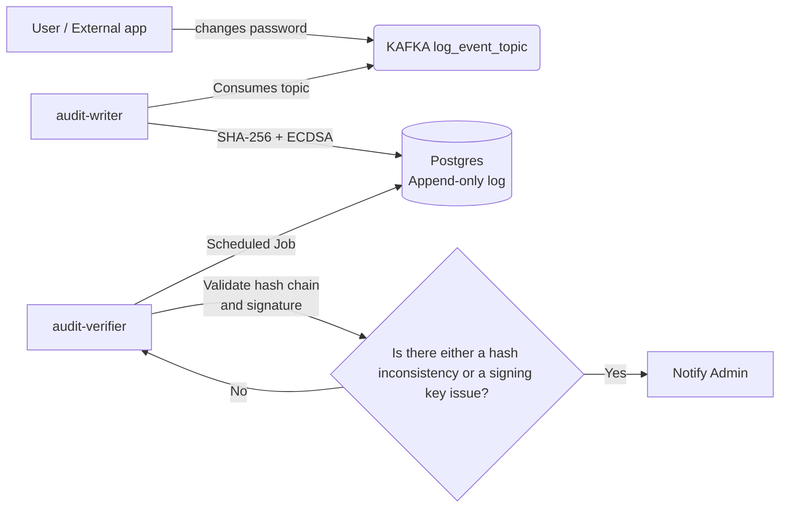
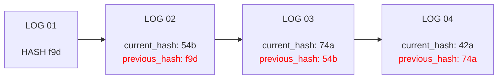

# audit-ledger

<div align="center">
  
  <p><strong>Don't Trust. Verify !</strong></p>
</div>


<div align="center">

  [Installation](#installation) ·
  [Design](#design) ·
  
</div>


## Description

An append-only audit logging system that uses cryptographic hash chains and ECDSA signatures to provide verifiable integrity and tamper detection for distributed systems.

## Stack
This project uses the following stack:

- Java 21
- Maven
- Docker && Docker-compose
- Spring Boot framework
- Apache Kafka
- PostgreSQL
- Flyway

## Installation

1- Clone this repository

```bash
git clone git@github.com:igorsoares/audit-ledger.git
```

2- Docker compose run

```bash
cd audit-ledger && docker-compose up -d
```

### Configuration

To run this project correctly, you will need an ECDSA key pair.

On Unix-based systems, you can generate it using the following commands:

1- Generate a private key

```bash
openssl ecparam -name prime256v1 -genkey -noout -out ecdsa_01.pem
```

This file will be used in the audit-verifier project to verify log signatures.

**Please ensure that the private key file (ecdsa_01.pem) is stored securely.**

2- Generate a public key

```bash
openssl ec -in ecdsa_01.pem -pubout -out ec_public.pem
```

This file will be used in the `audit-verifier` project to verify the signature of logs.

## Design




This software is designed to work with two microsservices. 

### Audit Writer
The first one, `audit-writer` is responsible for receiving all the events from Kafka and process them.

It is responsible for validing all input events and do all the math problems, such as hashing (SHA256) and the digital signing (ECDSA)

### Audit verifier
The second one, `audit-verifier`, is responsible for verifying the entire chain of logs.

It works through a scheduled function (@Schedule), ensuring the hashes and the signing key.

**In case of data violation, it will notify the system administrator.**

### Why hash chains and digital signatures ?
Hash chains ensure **event ordering and historical integrity**, since every record is linked to the previous one through a cryptographic hash.



In the example above, there are four audit log records.  

Now imagine that someone tries to tamper with **log 02**, changing the information to claim that it was not Alice who requested a new payment method, but Bob.

After this unauthorized modification, the hash of the **log 02** record would change completely, breaking the entire chain (**log 03**, **log 04**, and so on), since each record depends on the hash of the previous one.

The digital signature (ECDSA) ensure authenticity and non-repudiation.

**Even if an attacker recalculates the entire hash chain, they would still need the private key to forge the logs.**

As long as the private key remains secure, any unauthorized modification of the audit logs will be detected.
